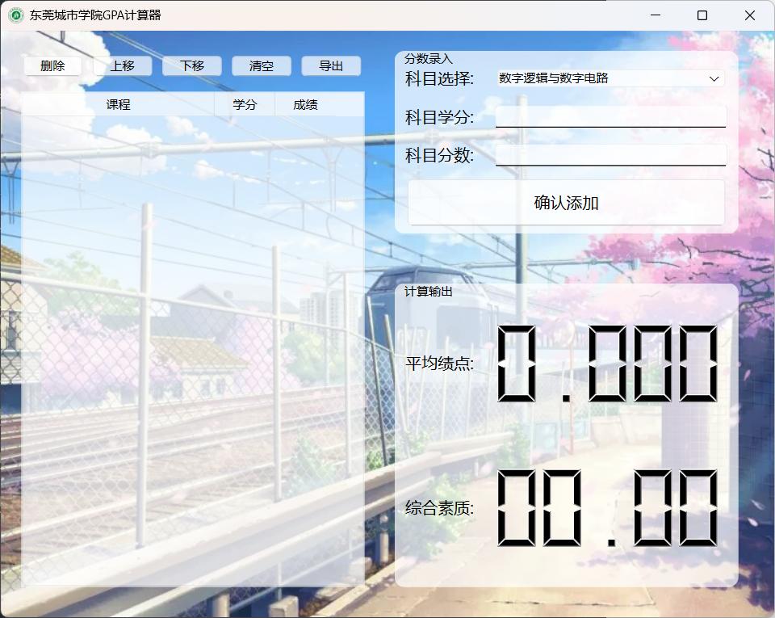

# DGCU GPA Calculator

    
<br />

<p align="center">
  <a href="https://github.com/shaojintian/Best_README_template/">
    
  </a>
  <h3 align="center">东莞城市学院绩点计算器</h3>
  <p align="center">
    <span style="display:block; margin-bottom:10px;">一款基于QT6的绩点计算器,结果可导出为Excel表</span>
    <br/>
    
    <br/>
    
    
    
    
    <br/>
    <a href="https://github.com/shaojintian/Best_README_template">查看Demo</a>
    ·
    <a href="https://github.com/shaojintian/Best_README_template/issues">报告Bug</a>
    ·
    <a href="https://github.com/shaojintian/Best_README_template/issues">提出新特性</a>
  </p>
</p>


 
## 目录

- [DGCU GPA Calculator](#dgcu-gpa-calculator)
  - [目录](#目录)
    - [使用指南](#使用指南)
          - [如何下载安装](#如何下载安装)
          - [开发前的配置要求](#开发前的配置要求)
          - [编译项目](#编译项目)
    - [作者](#作者)
    - [版权说明](#版权说明)

### 使用指南

###### 如何下载安装

等待更新

###### 开发前的配置要求

1. Visual Studio 2022 (可选MinGW + VS Code)
2. QT6
3. CMake
4. VCPKG
5. Git

###### 编译项目

1. 克隆项目
2. 安装仓库自带的VCPKG清单
3. 打开Visual Studio 2022, 点击`打开文件夹`, 打开本项目
4. 点击`生成`->`全部生成`即可完成编译

```sh
git clone https://github.com/sAkuraOfficial/DGCU_GPA_Calculator.git
cd ./DGCU_GPA_Calculator
vcpkg install
```


### 作者

mchaohao159@outlook.com

### 版权说明

该项目签署了MIT 授权许可，详情请参阅 [LICENSE.txt](https://github.com/sAkuraOfficial/DGCU_GPA_Calculator/blob/master/LICENSE.txt)


